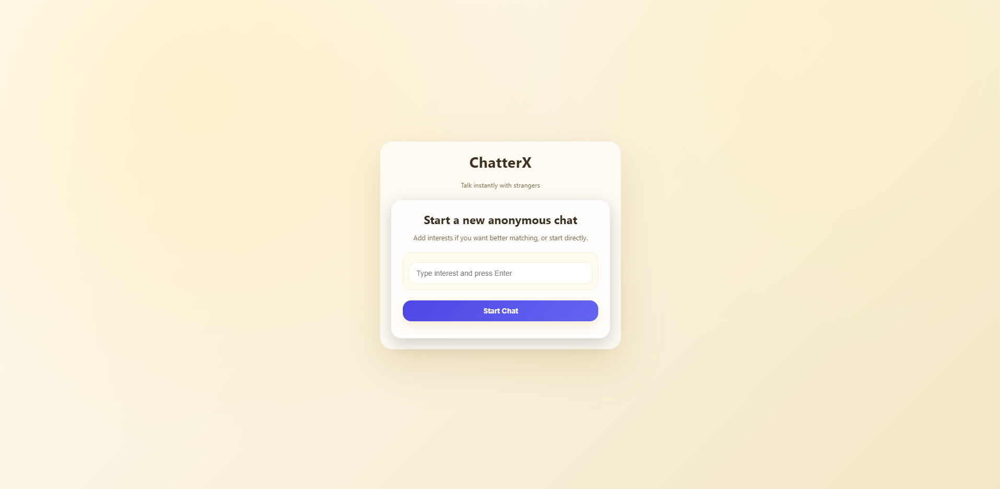
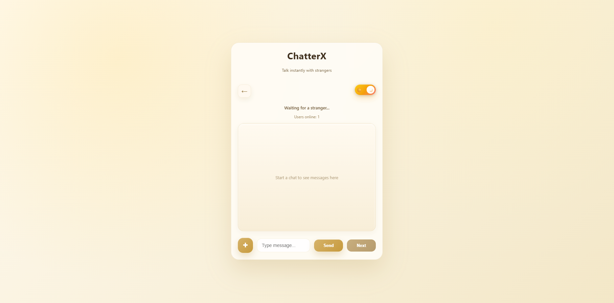
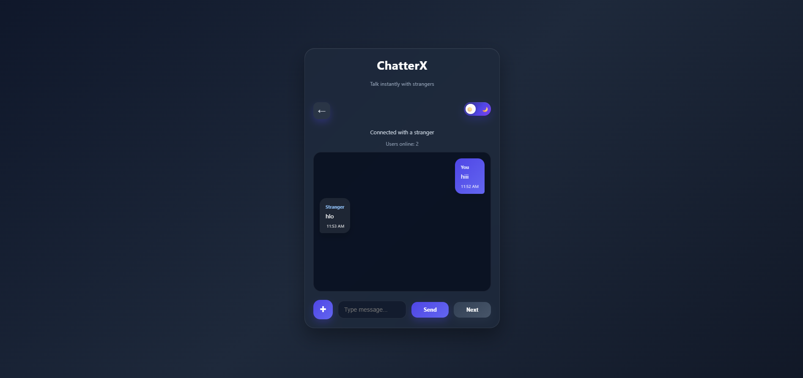
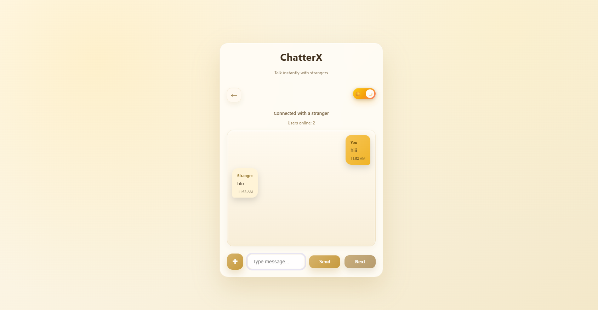

# 🚀 ChatterX – Real-Time Anonymous Chat App

ChatterX is a real-time anonymous chat application where users can connect with strangers based on shared interests. It enables instant messaging, media sharing, and smooth user matching using WebSockets.

---

## 🌐 Live Demo

👉 https://chatterx-9sb6.onrender.com/

---

## 📌 Features

* 🔗 **Anonymous One-to-One Chat**
* 🎯 **Interest-Based Matching**
* ⚡ **Real-Time Messaging (Socket.IO)**
* ⌨️ **Typing Indicator**
* 🔄 **Next Stranger (with confirmation flow)**
* 🖼️ **Media Sharing (Image & Video)**
* 🌙 **Dark / Light Theme Toggle**
* 🚨 **User Reporting System**
* 📊 **Online Users Counter**

---

## 🛠️ Tech Stack

### Frontend

* HTML5
* CSS3 (Glassmorphism UI)
* JavaScript (Vanilla JS)

### Backend

* Node.js
* Express.js
* Socket.IO

### File Handling

* Multer (for media upload)

---

## 🧠 How It Works

1. User enters an interest and starts chat
2. Backend stores user in a waiting queue
3. Matching algorithm finds another user with similar interest
4. Both users are connected in a private room
5. Messages are exchanged in real-time via Socket.IO
6. User can skip to next stranger anytime

---

## 📁 Project Structure

```
ChatterX/
│
├── server.js          # Backend logic (Express + Socket.IO)
├── package.json       # Dependencies
│
├── public/
│   ├── index.html     # UI structure
│   ├── style.css      # Styling
│   └── script.js      # Frontend logic
│
├── uploads/           # Uploaded media files
├── reports/           # User reports (JSON)
```

---

## ⚙️ Installation & Setup

1. Clone the repository

```bash
git clone https://github.com/techraj741/ChatterX.git
cd ChatterX
```

2. Install dependencies

```bash
npm install
```

3. Run the server

```bash
npm start
```

4. Open in browser

```
http://localhost:3000
```

---

## 📸 Screenshots

### 🏠 Home Screen


### ⏳ Waiting / Matching Screen


### 🌙 Chat Screen - Dark Mode


### ☀️ Chat Screen - Light Mode


---

## 🚧 Limitations

* No database (data stored locally)
* Chats are not saved (no history)
* No authentication system
* Basic report system

---

## 🔮 Future Improvements

* Add database (MongoDB)
* User authentication
* Chat history storage
* AI moderation / abuse detection
* React-based frontend
* Mobile responsiveness improvements

---

## 🎓 Project Purpose

This project is developed as part of academic submission to demonstrate:

* Real-time communication using WebSockets
* Backend development with Node.js & Express
* File handling and media upload
* Frontend + backend integration

---

## 👨‍💻 Author

**Raj Burman**
📧 [burmanraj494@gmail.com](mailto:burmanraj494@gmail.com)
🔗 GitHub: https://github.com/techraj741

---

## ⭐ If you like this project

Give it a ⭐ on GitHub and share feedback!
