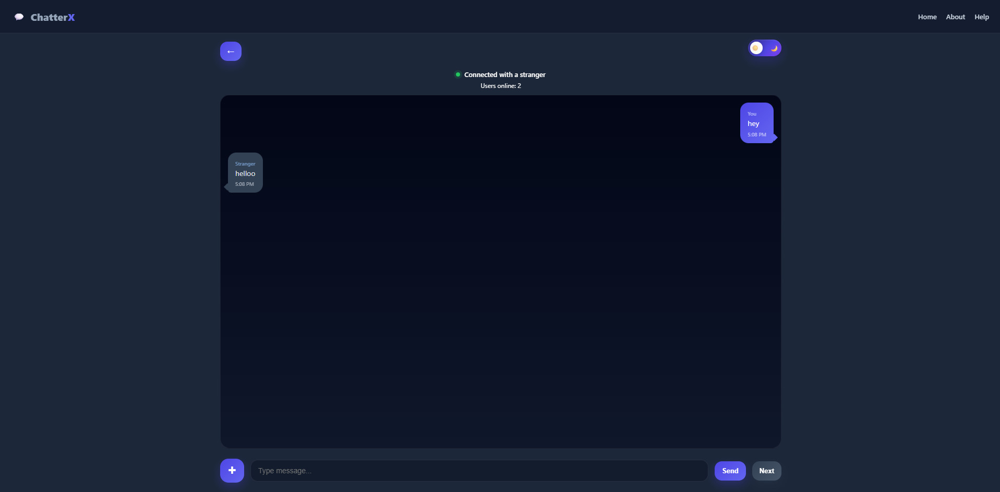
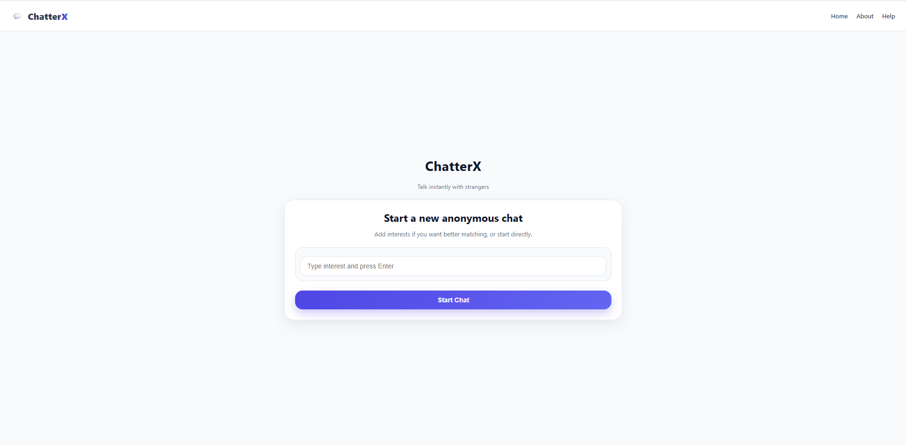
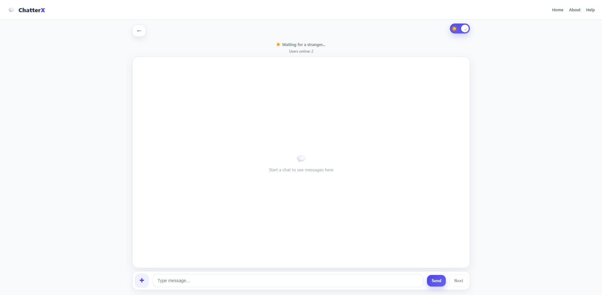
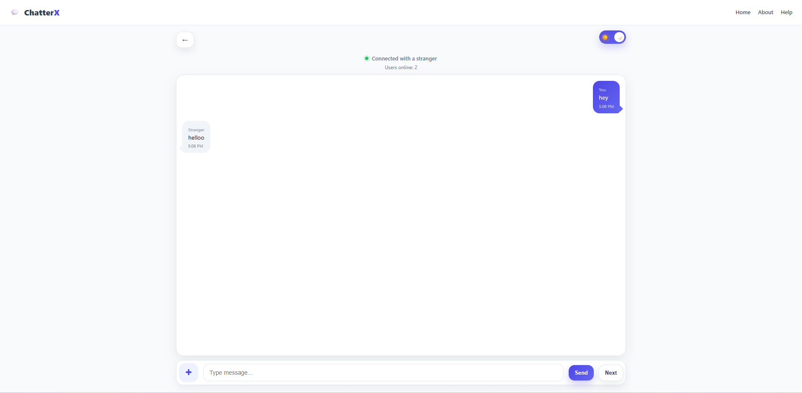
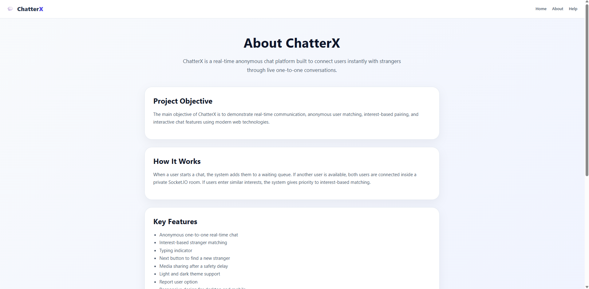
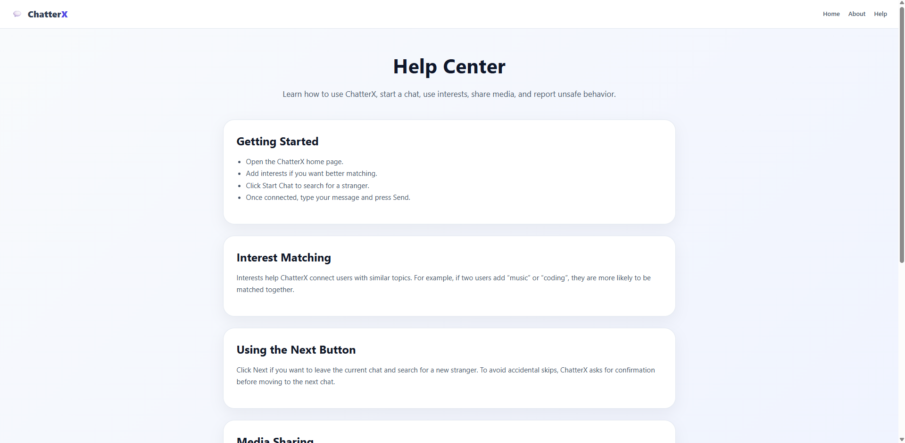
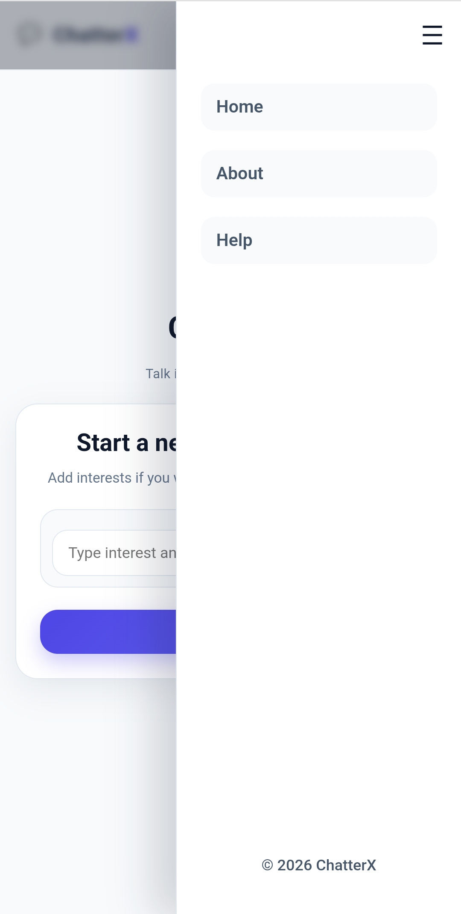
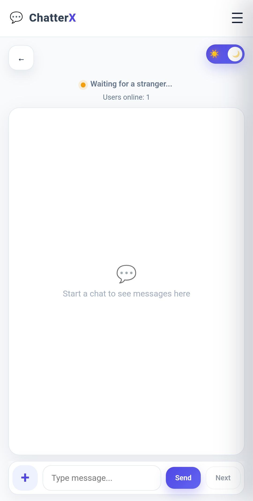

# 🚀 ChatterX – Real-Time Anonymous Chat Application

ChatterX is a real-time anonymous chat platform where users can instantly connect with strangers for one-to-one conversations. The application supports interest-based matching, real-time messaging, media sharing, responsive design, and modern UI interactions using WebSockets.

---

## 🌐 Live Demo

👉 https://chatterx-9sb6.onrender.com/

---

## 📸 Preview

### 🌙 Chat Interface (Dark Mode)



---

## 📌 Features

* 🔗 Anonymous One-to-One Chat
* 🎯 Interest-Based Stranger Matching
* ⚡ Real-Time Messaging using Socket.IO
* ⌨️ Live Typing Indicator
* 🔄 Next Stranger Flow with Confirmation
* 🖼️ Image & Video Sharing
* 🌙 Dark / Light Theme Toggle
* 🚨 User Reporting System
* 📊 Online Users Counter
* 📱 Responsive Design for Desktop & Mobile
* 📄 About and Help Pages

---

## 🛠️ Tech Stack

### Frontend
* HTML5
* CSS3
* Vanilla JavaScript

### Backend
* Node.js
* Express.js
* Socket.IO

### File Handling
* Multer

### Deployment & Tools
* Render
* GitHub

---

## 🧠 How It Works

1. User optionally enters interests
2. User joins the waiting queue
3. ChatterX searches for another compatible stranger
4. If matching interests are found, priority matching is used
5. Both users join a private Socket.IO room
6. Messages and media are exchanged in real-time
7. Users can leave or switch chats anytime

---

## 📁 Project Structure

```txt
ChatterX/
│
├── server.js
├── package.json
├── package-lock.json
│
├── public/
│   ├── index.html
│   ├── about.html
│   ├── help.html
│   ├── style.css
│   └── script.js
│
├── reports/
│   └── reports.json
│
├── assets/
│   └── screenshots/
│
└── README.md
```

---

## ⚙️ Installation & Setup

### 1️⃣ Clone the repository

```bash
git clone https://github.com/techraj741/ChatterX.git
cd ChatterX
```

### 2️⃣ Install dependencies

```bash
npm install
```

### 3️⃣ Start the server

```bash
npm start
```

### 4️⃣ Open in browser

```txt
http://localhost:3000
```

---

## 📸 Screenshots

### 🏠 Welcome Screen



---

### ⏳ Searching / Waiting Screen



---

### 🌙 Chat Screen – Dark Theme


---

### ☀️ Chat Screen – Light Theme



---

### 📄 About Page



---

### 🛟 Help Center



---

### 📱 Mobile Navigation



---

### 📱 Mobile Chat Screen



---

## 🚧 Current Limitations

* No database integration
* Chat history is not stored
* No authentication system
* Basic moderation/report handling
* Media files are stored locally

---

## 🔮 Future Improvements

* MongoDB database integration
* Optional user authentication
* Chat history storage
* WebRTC audio/video calling
* AI moderation and abuse detection
* Redis-based scalable queue system
* React frontend migration

---

## 🎓 Academic Purpose

This project was developed as a major academic project to demonstrate:

* Real-time communication using WebSockets
* Backend development with Node.js & Express
* Frontend and backend integration
* Real-time user matching systems
* Media upload and handling
* Responsive UI/UX implementation

---

## 👨‍💻 Author

### Raj Burman

📧 burmanraj494@gmail.com  
🔗 GitHub: https://github.com/techraj741

---

## ⭐ Support

If you like this project, give it a ⭐ on GitHub.
